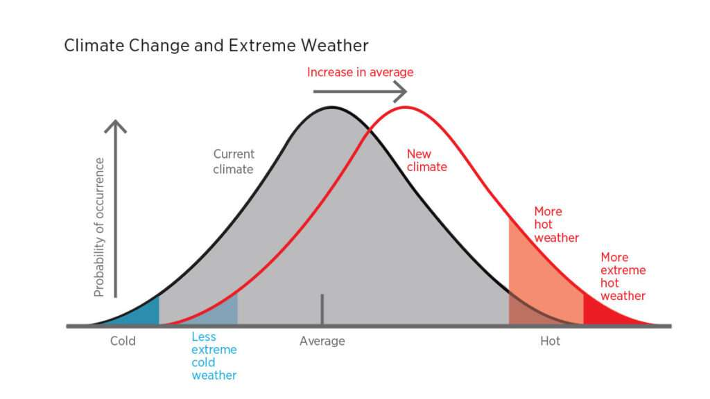
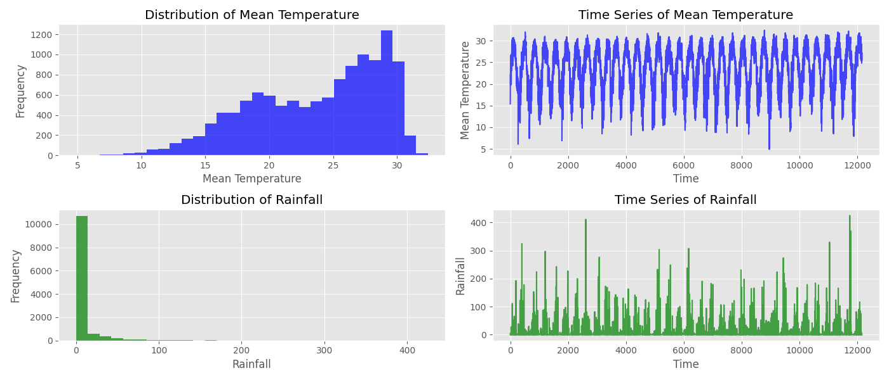

# Temperature Prediction

### Why do we have to predict the temperature?

Predicting temperature plays a crucial role in various aspects of modern life, from climate adaptation to economic planning.

### Climate Change & Extreme Weather

Rising temperatures and extreme weather conditions—such as heat waves and cold snaps—have direct consequences on agriculture, energy consumption, and public health. Accurate temperature predictions enable cities to prepare for heat-related health risks such as heat exhaustion, heat stroke, and dehydration. They also help farmers optimize crop schedules to maximize yield and efficiency.

### Economic & Social Implications

Temperature predictions are essential for economic and infrastructural planning. Energy grids, disaster management, and transportation systems benefit immensely from knowing upcoming temperature changes. Reliable forecasts help authorities allocate resources efficiently, minimizing disruptions and enhancing preparedness for adverse weather conditions.

### Why We Choose Temperature Insteaed of Rainfall

